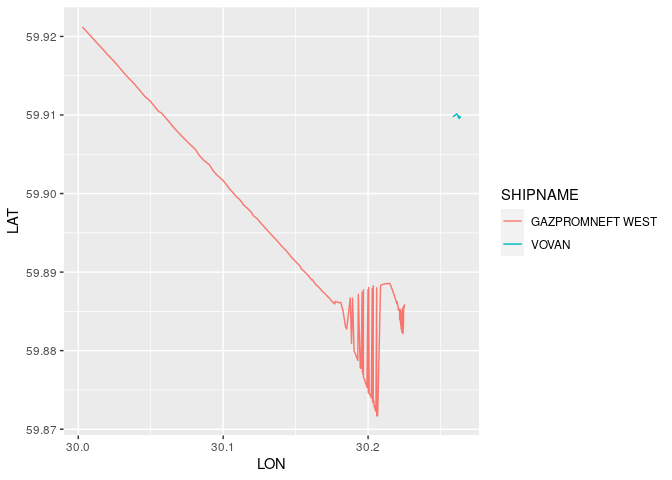
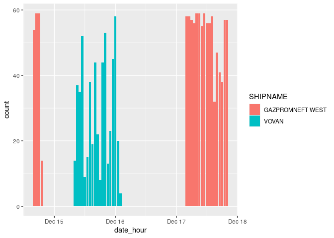
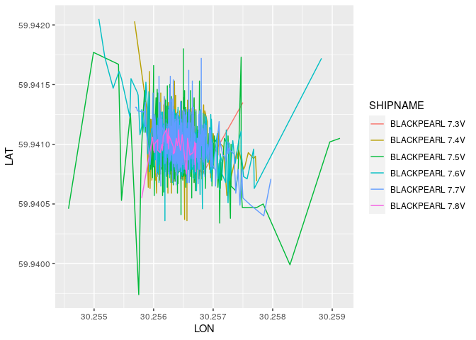
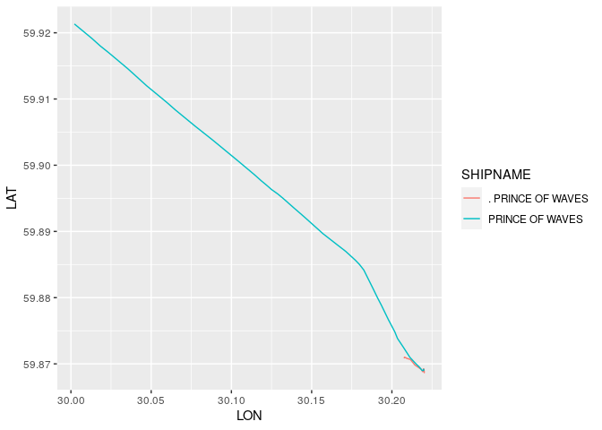

Initial Look at the Raw Data
================
Aleksander Dietrichson, PhD
2/27/2021

``` r
raw_data_path <- here::here("raw_data","ships.csv")

if(!file.exists(raw_data_path)){
  #Unzip
  utils::unzip(here::here("raw_data","ships_data.zip"),exdir=here::here("raw_data"))
}

raw_data <- readr::read_csv(raw_data_path, guess_max = Inf ) 
```

    ## Warning: `guess_max` is a very large value, setting to `21474836` to avoid
    ## exhausting memory

    ## 
    ## ── Column specification ────────────────────────────────────────────────────────
    ## cols(
    ##   .default = col_double(),
    ##   DESTINATION = col_character(),
    ##   FLAG = col_character(),
    ##   SHIPNAME = col_character(),
    ##   DATETIME = col_datetime(format = ""),
    ##   PORT = col_character(),
    ##   date = col_date(format = ""),
    ##   ship_type = col_character(),
    ##   port = col_character()
    ## )
    ## ℹ Use `spec()` for the full column specifications.

## Variables

``` r
str(raw_data)
```

    ## tibble [3,102,887 × 26] (S3: spec_tbl_df/tbl_df/tbl/data.frame)
    ##  $ LAT        : num [1:3102887] 54.8 54.8 54.8 54.8 54.7 ...
    ##  $ LON        : num [1:3102887] 19 19 19 19 19 ...
    ##  $ SPEED      : num [1:3102887] 99 100 102 102 102 102 101 101 102 104 ...
    ##  $ COURSE     : num [1:3102887] 200 200 196 198 196 198 197 194 199 199 ...
    ##  $ HEADING    : num [1:3102887] 196 196 196 196 195 196 196 196 196 197 ...
    ##  $ ELAPSED    : num [1:3102887] 2 2 2 2 2 2 2 2 2 2 ...
    ##  $ DESTINATION: chr [1:3102887] "GDANSK" "GDANSK" "GDANSK" "GDANSK" ...
    ##  $ FLAG       : chr [1:3102887] "MT" "MT" "MT" "MT" ...
    ##  $ LENGTH     : num [1:3102887] 100 100 100 100 100 100 100 100 100 100 ...
    ##  $ ROT        : num [1:3102887] 0 0 0 0 0 0 0 0 0 0 ...
    ##  $ SHIPNAME   : chr [1:3102887] "KAROLI" "KAROLI" "KAROLI" "KAROLI" ...
    ##  $ SHIPTYPE   : num [1:3102887] 7 7 7 7 7 7 7 7 7 7 ...
    ##  $ SHIP_ID    : num [1:3102887] 2764 2764 2764 2764 2764 ...
    ##  $ WIDTH      : num [1:3102887] 14 14 14 14 14 14 14 14 14 14 ...
    ##  $ L_FORE     : num [1:3102887] 91 91 91 91 91 91 91 91 91 91 ...
    ##  $ W_LEFT     : num [1:3102887] 7 7 7 7 7 7 7 7 7 7 ...
    ##  $ DWT        : num [1:3102887] 5727 5727 5727 5727 5727 ...
    ##  $ GT_SHIPTYPE: num [1:3102887] 144 144 144 144 144 144 144 144 144 144 ...
    ##  $ LEGEND     : num [1:3102887] 1 1 1 1 1 1 1 1 1 1 ...
    ##  $ DATETIME   : POSIXct[1:3102887], format: "2016-12-19 11:29:01" "2016-12-19 11:31:02" ...
    ##  $ PORT       : chr [1:3102887] "gdansk" "gdansk" "gdansk" "gdansk" ...
    ##  $ date       : Date[1:3102887], format: "2016-12-19" "2016-12-19" ...
    ##  $ week_nb    : num [1:3102887] 51 51 51 51 51 51 51 51 51 51 ...
    ##  $ ship_type  : chr [1:3102887] "Cargo" "Cargo" "Cargo" "Cargo" ...
    ##  $ port       : chr [1:3102887] "Gdańsk" "Gdańsk" "Gdańsk" "Gdańsk" ...
    ##  $ is_parked  : num [1:3102887] 0 0 0 0 0 0 0 0 0 0 ...
    ##  - attr(*, "spec")=
    ##   .. cols(
    ##   ..   LAT = col_double(),
    ##   ..   LON = col_double(),
    ##   ..   SPEED = col_double(),
    ##   ..   COURSE = col_double(),
    ##   ..   HEADING = col_double(),
    ##   ..   ELAPSED = col_double(),
    ##   ..   DESTINATION = col_character(),
    ##   ..   FLAG = col_character(),
    ##   ..   LENGTH = col_double(),
    ##   ..   ROT = col_double(),
    ##   ..   SHIPNAME = col_character(),
    ##   ..   SHIPTYPE = col_double(),
    ##   ..   SHIP_ID = col_double(),
    ##   ..   WIDTH = col_double(),
    ##   ..   L_FORE = col_double(),
    ##   ..   W_LEFT = col_double(),
    ##   ..   DWT = col_double(),
    ##   ..   GT_SHIPTYPE = col_double(),
    ##   ..   LEGEND = col_double(),
    ##   ..   DATETIME = col_datetime(format = ""),
    ##   ..   PORT = col_character(),
    ##   ..   date = col_date(format = ""),
    ##   ..   week_nb = col_double(),
    ##   ..   ship_type = col_character(),
    ##   ..   port = col_character(),
    ##   ..   is_parked = col_double()
    ##   .. )

## Check for Duplicates

``` r
my_dups <- duplicated(raw_data)
sum(my_dups)
```

    ## [1] 38420

Given the actual requirements for this project, these duplicates are
probably of little consequence, however, we should probably remove them
to be on the safe side. Furthermore looking an analysis of the
duplicates themselves may help shed light on the reason for their
existence - this is, however, beyond the scope of this project.

### Removing duplicates

``` r
raw_data <- raw_data[!my_dups,]
```

## SHIP\_ID

Because of its name, this variable intuitively looks like a unique
identifier. While the requirements only mentions “ship name”, it may be
worth exploring the relationship between these two variables.

``` r
# Quick and dirty test. The two numbers could be equal by coincidence.
raw_data$SHIP_ID %>% unique %>% length
```

    ## [1] 1210

``` r
raw_data$SHIPNAME %>% unique %>% length
```

    ## [1] 1187

OK, so there are at least some inconsistency here. Let’s explore
further. Firstly the counts above indicate that some SHIP\_IDs share the
same name.

``` r
tmpDF <- raw_data %>% 
  group_by(SHIPNAME) %>% 
  summarize(
    n_ids = n_distinct(SHIP_ID)
  ) %>% filter(n_ids>1)
tmpDF
```

    ## # A tibble: 21 x 2
    ##    SHIPNAME  n_ids
    ##    <chr>     <int>
    ##  1 [SAT-AIS]    19
    ##  2 ALANA         2
    ##  3 AMANDA        2
    ##  4 ARGO          2
    ##  5 AURA          2
    ##  6 BALTICA       2
    ##  7 BEDA          2
    ##  8 EKEN          2
    ##  9 FREYA         2
    ## 10 LINDA         2
    ## # … with 11 more rows

So it looks like we have double ids for nineteen actual vessels, and
then a “\[SAT-AIS\]” alternatively “SAT AIS”. The latter is presumably
an acronym for “Satelite Automatic Identification System”, which is
likely not the name of a vessel. We will therefore remove the
corresponding data-points.

Working off of the common sense (but by us unverified) notion that
ship-names are likely required to be unique within each sovereign
nations ship’s registry we can attempt to use the “FLAG” variable to
unpack this a little further.

``` r
tmpDF2 <- raw_data %>% 
  group_by(SHIPNAME, FLAG) %>% 
  tally %>% 
  filter(SHIPNAME %in% tmpDF$SHIPNAME,
         !SHIPNAME %in% c("SAT AIS","[SAT-AIS]"))
 tmpDF2 
```

    ## # A tibble: 32 x 3
    ## # Groups:   SHIPNAME [19]
    ##    SHIPNAME FLAG      n
    ##    <chr>    <chr> <int>
    ##  1 ALANA    PT      552
    ##  2 ALANA    RU     8425
    ##  3 AMANDA   DK       52
    ##  4 AMANDA   SE     1126
    ##  5 ARGO     NL     3537
    ##  6 ARGO     PL     4719
    ##  7 AURA     FI     1171
    ##  8 AURA     RU     8070
    ##  9 BALTICA  FI      558
    ## 10 BALTICA  PL     2890
    ## # … with 22 more rows

Our intuition seems to have been justified for most of the data, we
still do have some duplicates unaccounted for:

``` r
tmpDF3 <- 
  tmpDF2 %>% 
  group_by(SHIPNAME) %>% 
  summarize(n=n()) %>% 
  filter(n<2)
tmpDF3
```

    ## # A tibble: 6 x 2
    ##   SHIPNAME     n
    ##   <chr>    <int>
    ## 1 BEDA         1
    ## 2 TINDRA       1
    ## 3 TORNADO      1
    ## 4 ULRIKA       1
    ## 5 VOVAN        1
    ## 6 YASNYY       1

Perhaps we can take a look at other characteristics to unravel this:

``` r
tmpDF4 <- raw_data %>% 
  filter(SHIPNAME %in% tmpDF3$SHIPNAME,
         !duplicated(SHIP_ID)) %>% 
  arrange(SHIPNAME) %>% 
  select(SHIPNAME, SHIP_ID,PORT,port,ship_type,everything())
tmpDF4
```

    ## # A tibble: 11 x 26
    ##    SHIPNAME SHIP_ID PORT  port  ship_type   LAT   LON SPEED COURSE HEADING
    ##    <chr>      <dbl> <chr> <chr> <chr>     <dbl> <dbl> <dbl>  <dbl>   <dbl>
    ##  1 BEDA      321089 goth… goth… Passenger  57.7  11.7    63     51      46
    ##  2 BEDA     3534813 goth… goth… Pleasure   57.7  11.8     2      0     511
    ##  3 TINDRA   3967129 goth… goth… Pleasure   57.7  11.8    32     80     511
    ##  4 TINDRA   4068490 goth… goth… Pleasure   57.7  11.8     0      0     511
    ##  5 TORNADO   347113 kali… Kali… Tug        54.6  20.0    89     81      84
    ##  6 TORNADO   346208 st_p… St. … Tug        59.9  30.2     0      0     511
    ##  7 ULRIKA   1085676 goth… goth… Passenger  57.8  11.6     0    256     282
    ##  8 ULRIKA   3936535 goth… goth… Fishing    57.7  11.7     0      0     511
    ##  9 VOVAN    4709602 st_p… St. … Tanker     59.9  30.3     0      0     511
    ## 10 YASNYY    349997 kali… Kali… Tug        54.7  19.8    60    122     124
    ## 11 YASNYY   4645311 kali… Kali… Tug        54.7  19.8    65    127     511
    ## # … with 16 more variables: ELAPSED <dbl>, DESTINATION <chr>, FLAG <chr>,
    ## #   LENGTH <dbl>, ROT <dbl>, SHIPTYPE <dbl>, WIDTH <dbl>, L_FORE <dbl>,
    ## #   W_LEFT <dbl>, DWT <dbl>, GT_SHIPTYPE <dbl>, LEGEND <dbl>, DATETIME <dttm>,
    ## #   date <date>, week_nb <dbl>, is_parked <dbl>

We can see that these are clearly not the same vessels. In some cases
they are different “types”, in other they are the same types, but have
significantly different length, width and other characteristics. We will
arbitrarily add a “II” to the one with the highest SHIP\_ID.

## SHIPNAME

We should also look at the opposite case, i.e. check is any of the
SHIP\_IDs correspond to multiple names.

``` r
tmpDF5 <- raw_data %>% 
  group_by(SHIP_ID) %>% 
  summarize(
    n_names = n_distinct(SHIPNAME)
  ) %>% filter(n_names > 1 )
tmpDF5
```

    ## # A tibble: 11 x 2
    ##    SHIP_ID n_names
    ##      <dbl>   <int>
    ##  1  315731       2
    ##  2  315950       2
    ##  3  316404       2
    ##  4  316482       2
    ##  5  345254       2
    ##  6  347195       2
    ##  7  364937       2
    ##  8  406999       2
    ##  9  757619       2
    ## 10 3653787       2
    ## 11 4666609       6

We have a similar problem. Let’s take a look.

``` r
tmpDF6 <- raw_data %>% 
  filter(SHIP_ID %in% tmpDF5$SHIP_ID) %>% 
  group_by(SHIPNAME,SHIP_ID) %>% 
  summarize() %>% 
  arrange(SHIP_ID)
```

    ## `summarise()` has grouped output by 'SHIPNAME'. You can override using the `.groups` argument.

``` r
tmpDF6
```

    ## # A tibble: 26 x 2
    ## # Groups:   SHIPNAME [26]
    ##    SHIPNAME          SHIP_ID
    ##    <chr>               <dbl>
    ##  1 BBAS               315731
    ##  2 ODYS               315731
    ##  3 .WLA-311           315950
    ##  4 WLA-311            315950
    ##  5 KAPITAN BORCHARDT  316404
    ##  6 KM ,TAN BORCHARDT  316404
    ##  7 WXA A SZCZESCIA    316482
    ##  8 WYSPA SZCZESCIA    316482
    ##  9 IVAN KRUZENSHTERN  345254
    ## 10 SAT AIS            345254
    ## # … with 16 more rows

Most of these look like spelling variation of the same name. We happen
to know that BBAS and ODYS is actually the same vessel. The only ones
that stand out are the combinations:

  - GAZPROMNEFT WEST & VOVAN
  - ARGO & C

<!-- end list -->

``` r
raw_data %>% 
  filter( SHIP_ID%in%tmpDF6$SHIP_ID) %>% 
  group_by(SHIPNAME,SHIP_ID, FLAG) %>% 
  summarize() %>% arrange(SHIP_ID)
```

    ## `summarise()` has grouped output by 'SHIPNAME', 'SHIP_ID'. You can override using the `.groups` argument.

    ## # A tibble: 26 x 3
    ## # Groups:   SHIPNAME, SHIP_ID [26]
    ##    SHIPNAME          SHIP_ID FLAG 
    ##    <chr>               <dbl> <chr>
    ##  1 BBAS               315731 PL   
    ##  2 ODYS               315731 PL   
    ##  3 .WLA-311           315950 PL   
    ##  4 WLA-311            315950 PL   
    ##  5 KAPITAN BORCHARDT  316404 PL   
    ##  6 KM ,TAN BORCHARDT  316404 PL   
    ##  7 WXA A SZCZESCIA    316482 PL   
    ##  8 WYSPA SZCZESCIA    316482 PL   
    ##  9 IVAN KRUZENSHTERN  345254 RU   
    ## 10 SAT AIS            345254 RU   
    ## # … with 16 more rows

“ARGO” and “C” have different flags, so we can use that to separate
them. A name like “C” however sounds odd, and we would need domain
expertise in order to determine if this is a data-entry mistake or in
fact the vessels real name.

Finally it is still whether GAZPROMNEFT WEST & VOVAN is the same vessel.

``` r
raw_data %>% 
  filter(SHIP_ID == 347195,
         !duplicated(SHIPNAME)
         )
```

    ## # A tibble: 2 x 26
    ##     LAT   LON SPEED COURSE HEADING ELAPSED DESTINATION FLAG  LENGTH   ROT
    ##   <dbl> <dbl> <dbl>  <dbl>   <dbl>   <dbl> <chr>       <chr>  <dbl> <dbl>
    ## 1  59.9  30.2    11    284     104       3 P.TURKMENB… RU        79     5
    ## 2  59.9  30.3     0      0     511       2 ST.PETERBU… RU        79     0
    ## # … with 16 more variables: SHIPNAME <chr>, SHIPTYPE <dbl>, SHIP_ID <dbl>,
    ## #   WIDTH <dbl>, L_FORE <dbl>, W_LEFT <dbl>, DWT <dbl>, GT_SHIPTYPE <dbl>,
    ## #   LEGEND <dbl>, DATETIME <dttm>, PORT <chr>, date <date>, week_nb <dbl>,
    ## #   ship_type <chr>, port <chr>, is_parked <dbl>

Based on the physical characteristics it looks like it may well be the
same vessel, maybe a visualization can help. Let’s trace their
respective courses.

``` r
raw_data %>% 
  filter(SHIP_ID == 347195) %>% 
  arrange(DATETIME) %>% 
  ggplot(aes(LON,LAT, color = SHIPNAME))+
  geom_line()
```

<!-- -->

Based on the discontinuity observed, we might reasonably conclude that
these are different vessels, although perhaps we are dealing with a
submarine?

Another possibility is that the vessel switched calling signals, and
switched off the AIS in some time periods. We can look at this by using
the “date” field available:

``` r
raw_data %>% 
 filter(SHIP_ID == 347195) %>%      
  arrange(DATETIME) %>% 
  group_by(SHIPNAME, date) %>% 
  summarize(n=n())
```

    ## `summarise()` has grouped output by 'SHIPNAME'. You can override using the `.groups` argument.

    ## # A tibble: 4 x 3
    ## # Groups:   SHIPNAME [2]
    ##   SHIPNAME         date           n
    ##   <chr>            <date>     <int>
    ## 1 GAZPROMNEFT WEST 2016-12-14   186
    ## 2 GAZPROMNEFT WEST 2016-12-17   903
    ## 3 VOVAN            2016-12-15   501
    ## 4 VOVAN            2016-12-16    52

And visualize over time:

``` r
raw_data %>% 
 filter(SHIP_ID == 347195) %>% 
  mutate(date_hour = round(DATETIME,units="hours")) %>% 
  mutate(date_hour = as.POSIXct(date_hour)) %>% #For my version of ggplot
  ggplot(aes(date_hour,fill=SHIPNAME))+
  geom_bar()
```

<!-- -->

The data are congruent with the vessel switching off their AIS and
switching calling signals. We will treat these as different vessels for
the purposes of this exercise.

Let’s take a look at the BLACKPEARLs as well:

``` r
raw_data %>% 
  filter(startsWith(SHIPNAME,"BLACKPEARL")) %>% 
  arrange(DATETIME) %>% 
  ggplot(aes(LON,LAT, color = SHIPNAME))+
  geom_line()
```

<!-- -->

Discontinuity here as well.

Sanity check:

``` r
raw_data %>% 
  filter(SHIP_ID == 757619) %>% 
  arrange(DATETIME) %>% 
  ggplot(aes(LON,LAT, color = SHIPNAME))+
  geom_line()
```

<!-- -->

Looks like a misspelling

## Conclusions

Some data-cleansing is needed prior to using this data. This consists
is:

  - Removing duplicates
  - Removing instances of “\[SAT-AIS\]” and “SAT AIS”
  - Adding FLAG to the names of twenty-six ships with similar names, but
    different flags.
  - Correcting the presumed misspellings of certain ship-names.
  - Adding FLAG designation to “ARGO” and “C”.
  - Arbitrarily adding a I & II designation to about ten ships with
    similar names, same flag, but different types and/or other
    characteristics.
  - Arbitrarily treating GAZPROM WEST and VOVAN as separate vessels
    (although we have our doubts).
