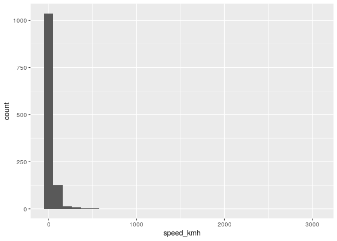

Post-hoc Analysis of Pre-Calculated Data
================
Aleksander Dietrichson, PhD
2/28/2021

## Purpose

The purpose of this document is to analyze the pre-calculated data we
are currently using for the shiny app. Looking at main variables as well
as potential inconsitencies may help us uncover bugs, and provide
further insights into the data, such as if further cleansing is needed.

``` r
pre_calc_path <- here::here("inst","app","shipsdata","ships.RDS")
myData <- readr::read_rds(pre_calc_path)
raw_data <- readr::read_csv(here::here("raw_data","ships.csv"))
```

    ## 
    ## ── Column specification ────────────────────────────────────────────────────────
    ## cols(
    ##   .default = col_double(),
    ##   DESTINATION = col_character(),
    ##   FLAG = col_character(),
    ##   SHIPNAME = col_character(),
    ##   DATETIME = col_datetime(format = ""),
    ##   PORT = col_character(),
    ##   date = col_date(format = ""),
    ##   ship_type = col_character(),
    ##   port = col_character()
    ## )
    ## ℹ Use `spec()` for the full column specifications.

``` r
str(myData)
```

    ## tibble [1,196 × 33] (S3: grouped_df/tbl_df/tbl/data.frame)
    ##  $ LAT              : num [1:1196] 57.7 55.8 57.6 55.7 54.5 ...
    ##  $ LON              : num [1:1196] 12 20.8 11.8 21.1 18.5 ...
    ##  $ SPEED            : num [1:1196] 10 77 103 76 0 0 0 75 70 83 ...
    ##  $ COURSE           : num [1:1196] 33 102 63 153 231 0 0 119 100 275 ...
    ##  $ HEADING          : num [1:1196] 511 511 69 156 59 0 0 511 511 511 ...
    ##  $ ELAPSED          : num [1:1196] 3 3 2 1 55 8 8 2 2 2 ...
    ##  $ DESTINATION      : chr [1:1196] "GOTHENBURG" "KLAIPEDA" NA NA ...
    ##  $ FLAG             : chr [1:1196] "SE" "LT" "SE" "LT" ...
    ##  $ LENGTH           : num [1:1196] 0 26 11 25 NA 0 0 25 25 25 ...
    ##  $ ROT              : num [1:1196] 0 0 720 0 0 NA NA 0 0 0 ...
    ##  $ SHIPNAME         : chr [1:1196] "0" "100" "11-00" "169" ...
    ##  $ SHIPTYPE         : num [1:1196] 0 2 3 2 0 1 1 2 2 2 ...
    ##  $ SHIP_ID          : num [1:1196] 323091 353293 324459 353306 4674280 ...
    ##  $ WIDTH            : num [1:1196] 0 6 4 7 NA 0 0 7 7 7 ...
    ##  $ L_FORE           : num [1:1196] 0 13 8 0 NA 0 0 8 7 6 ...
    ##  $ W_LEFT           : num [1:1196] 0 1 2 0 NA 0 0 4 5 6 ...
    ##  $ DWT              : num [1:1196] NA 61 NA 33 NA NA NA 30 30 30 ...
    ##  $ GT_SHIPTYPE      : num [1:1196] NA 37 NA 43 NA NA NA 37 43 43 ...
    ##  $ LEGEND           : num [1:1196] 1 1 1 0 0 0 0 1 1 0 ...
    ##  $ DATETIME         : POSIXct[1:1196], format: "2016-12-19 08:29:06" "2016-12-19 01:21:06" ...
    ##  $ PORT             : chr [1:1196] "gothenborg" "klaipeda" "gothenborg" "klaipeda" ...
    ##  $ date             : Date[1:1196], format: "2016-12-19" "2016-12-19" ...
    ##  $ week_nb          : num [1:1196] 51 51 50 51 51 50 50 51 51 50 ...
    ##  $ ship_type        : chr [1:1196] "Unspecified" "Fishing" "Tug" "Fishing" ...
    ##  $ port             : chr [1:1196] "gothenborg" "Klaipeda" "gothenborg" "Klaipeda" ...
    ##  $ is_parked        : num [1:1196] 0 0 0 0 1 1 1 0 0 0 ...
    ##  $ original_SHIPNAME: chr [1:1196] "0" "100" "11-00" "169" ...
    ##  $ prev_lon         : num [1:1196] 12 20.8 11.8 21.1 18.5 ...
    ##  $ prev_lat         : num [1:1196] 57.7 55.8 57.6 55.7 54.5 ...
    ##  $ prev_datetime    : POSIXct[1:1196], format: "2016-12-19 08:27:07" "2016-12-14 20:59:07" ...
    ##  $ seconds_btw_obs  : 'difftime' num [1:1196] 119 361319 120 481 ...
    ##   ..- attr(*, "units")= chr "secs"
    ##  $ advanced_meters  : num [1:1196] 111.52 2303.33 2094.08 1772.1 9.47 ...
    ##  $ speed_kmh        : num [1:1196] 3.37 2.29e-02 6.28e+01 1.33e+01 6.73e-04 ...
    ##  - attr(*, "groups")= tibble [1,196 × 2] (S3: tbl_df/tbl/data.frame)
    ##   ..$ SHIPNAME: chr [1:1196] "0" "100" "11-00" "169" ...
    ##   ..$ .rows   : list<int> [1:1196] 
    ##   .. ..$ : int 1
    ##   .. ..$ : int 2
    ##   .. ..$ : int 3
    ##   .. ..$ : int 4
    ##   .. ..$ : int 5
    ##   .. ..$ : int 6
    ##   .. ..$ : int 7
    ##   .. ..$ : int 8
    ##   .. ..$ : int 9
    ##   .. ..$ : int 10
    ##   .. ..$ : int 11
    ##   .. ..$ : int 12
    ##   .. ..$ : int 13
    ##   .. ..$ : int 14
    ##   .. ..$ : int 15
    ##   .. ..$ : int 16
    ##   .. ..$ : int 17
    ##   .. ..$ : int 18
    ##   .. ..$ : int 19
    ##   .. ..$ : int 20
    ##   .. ..$ : int 21
    ##   .. ..$ : int 22
    ##   .. ..$ : int 23
    ##   .. ..$ : int 24
    ##   .. ..$ : int 25
    ##   .. ..$ : int 26
    ##   .. ..$ : int 27
    ##   .. ..$ : int 28
    ##   .. ..$ : int 29
    ##   .. ..$ : int 30
    ##   .. ..$ : int 31
    ##   .. ..$ : int 32
    ##   .. ..$ : int 33
    ##   .. ..$ : int 34
    ##   .. ..$ : int 35
    ##   .. ..$ : int 36
    ##   .. ..$ : int 37
    ##   .. ..$ : int 38
    ##   .. ..$ : int 39
    ##   .. ..$ : int 40
    ##   .. ..$ : int 41
    ##   .. ..$ : int 42
    ##   .. ..$ : int 43
    ##   .. ..$ : int 44
    ##   .. ..$ : int 45
    ##   .. ..$ : int 46
    ##   .. ..$ : int 47
    ##   .. ..$ : int 48
    ##   .. ..$ : int 49
    ##   .. ..$ : int 50
    ##   .. ..$ : int 51
    ##   .. ..$ : int 52
    ##   .. ..$ : int 53
    ##   .. ..$ : int 54
    ##   .. ..$ : int 55
    ##   .. ..$ : int 56
    ##   .. ..$ : int 57
    ##   .. ..$ : int 58
    ##   .. ..$ : int 59
    ##   .. ..$ : int 60
    ##   .. ..$ : int 61
    ##   .. ..$ : int 62
    ##   .. ..$ : int 63
    ##   .. ..$ : int 64
    ##   .. ..$ : int 65
    ##   .. ..$ : int 66
    ##   .. ..$ : int 67
    ##   .. ..$ : int 68
    ##   .. ..$ : int 69
    ##   .. ..$ : int 70
    ##   .. ..$ : int 71
    ##   .. ..$ : int 72
    ##   .. ..$ : int 73
    ##   .. ..$ : int 74
    ##   .. ..$ : int 75
    ##   .. ..$ : int 76
    ##   .. ..$ : int 77
    ##   .. ..$ : int 78
    ##   .. ..$ : int 79
    ##   .. ..$ : int 80
    ##   .. ..$ : int 81
    ##   .. ..$ : int 82
    ##   .. ..$ : int 83
    ##   .. ..$ : int 84
    ##   .. ..$ : int 85
    ##   .. ..$ : int 86
    ##   .. ..$ : int 87
    ##   .. ..$ : int 88
    ##   .. ..$ : int 89
    ##   .. ..$ : int 90
    ##   .. ..$ : int 91
    ##   .. ..$ : int 92
    ##   .. ..$ : int 93
    ##   .. ..$ : int 94
    ##   .. ..$ : int 95
    ##   .. ..$ : int 96
    ##   .. ..$ : int 97
    ##   .. ..$ : int 98
    ##   .. ..$ : int 99
    ##   .. .. [list output truncated]
    ##   .. ..@ ptype: int(0) 
    ##   ..- attr(*, ".drop")= logi TRUE

The tibble is “grouped” probably not necessary.

## Calculated Speed

We calculate the speed in kilometers per hour as part of the
pre-calculations. This allows us a sanity check:

``` r
range(myData$speed_kmh)
```

    ## [1] NA NA

OK, we have some NA’s. Let’s find our how widespread this is

``` r
myData %>% 
  filter(is.na(speed_kmh)) %>% 
  summarize()
```

    ## # A tibble: 3 x 1
    ##   SHIPNAME          
    ##   <chr>             
    ## 1 PICKNICK LAGOON 39
    ## 2 PLB DEFENDER      
    ## 3 WILSON ALSTER

Three instances. Let’s confer with the raw data.

``` r
my_shipnames <- myData %>% 
           filter(is.na(speed_kmh)) %>% 
           pull(SHIPNAME)
raw_data %>% 
  filter(SHIPNAME %in% my_shipnames)
```

    ## # A tibble: 3 x 26
    ##     LAT   LON SPEED COURSE HEADING ELAPSED DESTINATION FLAG  LENGTH   ROT
    ##   <dbl> <dbl> <dbl>  <dbl>   <dbl>   <dbl> <chr>       <chr>  <dbl> <dbl>
    ## 1  57.7  11.8     0    188     511     122 CLASS B     SE        12    NA
    ## 2  55.0  20.4     1    143     511       3 CLASS B     RU       135    NA
    ## 3  55.7  20.8   117     89      89       2 KLAIPEDA    BB        82     0
    ## # … with 16 more variables: SHIPNAME <chr>, SHIPTYPE <dbl>, SHIP_ID <dbl>,
    ## #   WIDTH <dbl>, L_FORE <dbl>, W_LEFT <dbl>, DWT <dbl>, GT_SHIPTYPE <dbl>,
    ## #   LEGEND <dbl>, DATETIME <dttm>, PORT <chr>, date <date>, week_nb <dbl>,
    ## #   ship_type <chr>, port <chr>, is_parked <dbl>

So, we have three ships with only one observation in the raw data, and
so nothing to base our calculations on. We might *consider removing*
these from our pre-calculated data-set.

Now lets look at the speed again:

``` r
range(myData$speed_kmh, na.rm = TRUE)
```

    ## [1]    0.000 3030.552

``` r
mean(myData$speed_kmh, na.rm = TRUE)
```

    ## [1] 33.08899

``` r
median(myData$speed_kmh, na.rm = TRUE)
```

    ## [1] 16.1609

We clearly have some outliers, no vessel will travel at 3,000 kph\!

``` r
myData %>% 
  ggplot(aes(speed_kmh))+
  geom_histogram()
```

    ## `stat_bin()` using `bins = 30`. Pick better value with `binwidth`.

    ## Warning: Removed 3 rows containing non-finite values (stat_bin).

<!-- -->

The bulk (no pun intended) of our vessels have a completely reasonable
speed.

Let’s try some cutoff points:

``` r
myData %>% 
  filter(speed_kmh>100) %>% nrow()
```

    ## [1] 50

``` r
myData %>% 
  filter(speed_kmh>75) %>% nrow()
```

    ## [1] 86

``` r
myData %>% 
  filter(speed_kmh>50) %>% nrow()
```

    ## [1] 167

We should probably decide that anything over 75 kilometers per hour is
suspect, and indicate this in the interface. Pending another deep dive
(again no pun…) in the data we have little reason to chalk this up as
anything but “dirty raw data”.
